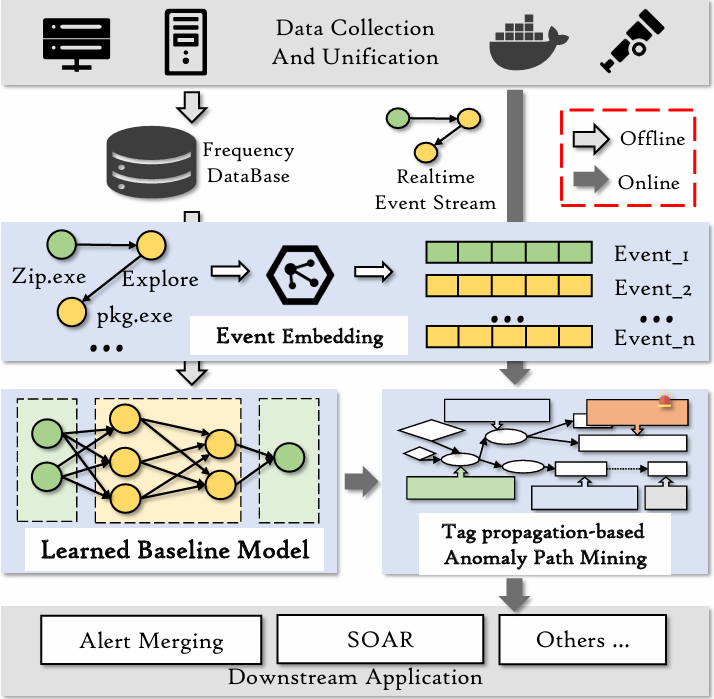

# RAPiDLe
> Intrusion Detection Based on Path Mining in Provenance Graph.

Welcome to the RAPiDLe repository. 

## System Overview


## Prerequisites

### Prepare Environment
1. ***Development tools***: To run RAPiDLe you need to install Python and pyFlink. More detailed instructions on running RAPiDLe can be found at the [pyFlink](https://nightlies.apache.org/flink/flink-docs-release-1.17/docs/dev/python/overview/).
2. ***Configure dependencies***: The mainly dependencies are listed in [requirements.txt](requirements.txt) for more detailed information.  

### Prepare Data Stream
RAPiDLe is evaluated on open-source datasets from Darpa and ASAL.  Other developers need to parse and send logs to kafka using code from [log_producer](log_producer).

## Evaluation
### Start Kafka
```shell
    docker compose up -d
```
### Start RAPiDLe
```python
    python main.py
```
